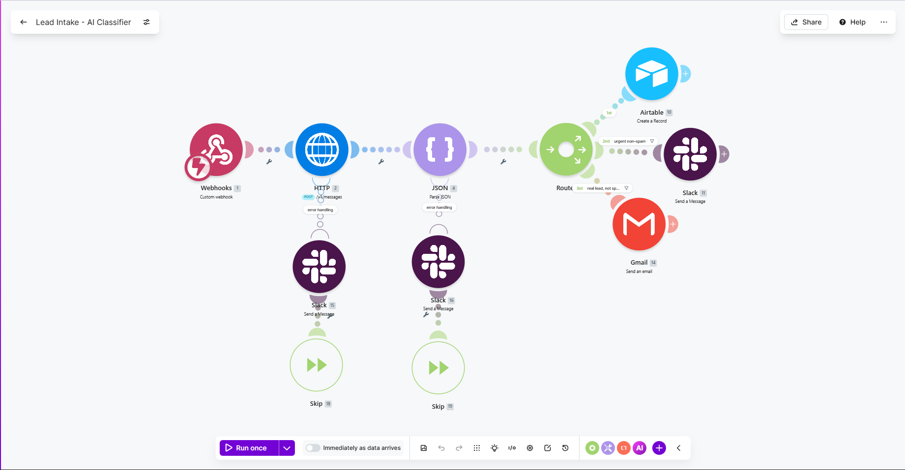
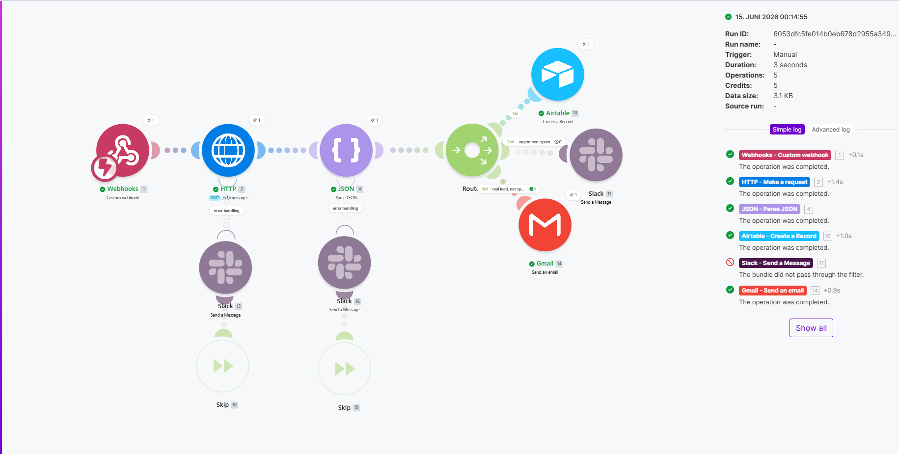
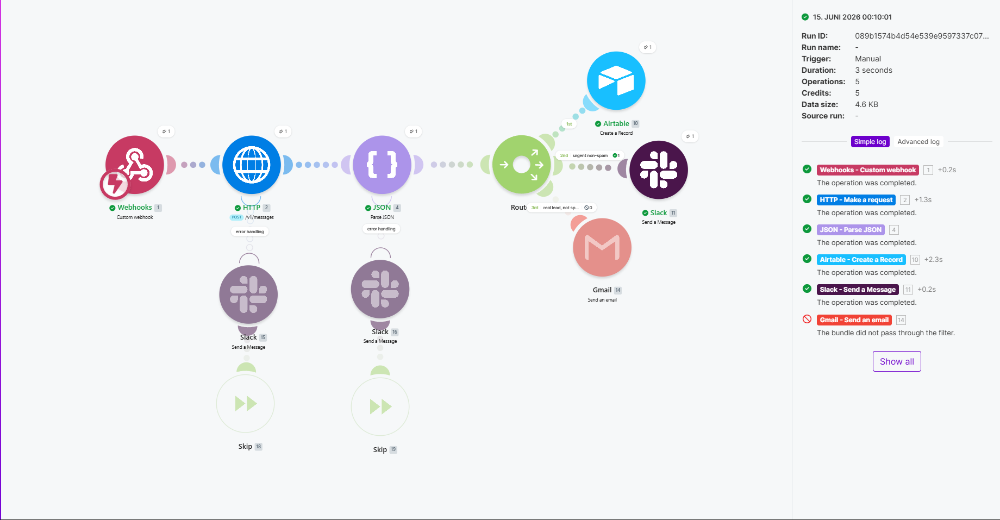

# Lead Intake - AI Classifier (Make.com)

An AI-powered lead-intake automation built in [Make.com](https://www.make.com). When a website contact form is submitted, it classifies the lead with Anthropic's Claude, logs every lead to Airtable, sends an instant Slack alert for urgent leads, auto-replies to genuine leads by email, and reports failures gracefully instead of crashing.

The complete scenario is included as an importable blueprint.

## What it does

One inbound contact-form submission flows through a single Make scenario:

1. **Webhook** receives the submission (name, email, message).
2. **HTTP to Claude** sends the message to the Anthropic Messages API and returns a structured judgment: is it a real lead, is it spam, an urgency score (1 to 10), an intent category (pricing, support, demo, partnership, spam, other), and a suggested next action.
3. **Parse JSON** turns Claude's reply into separate, usable fields.
4. **Router** splits into three paths:
   - **Always:** create an Airtable record, so every lead is logged.
   - **Urgent and not spam** (urgency 8+ and not spam): post a Slack alert to a client-alerts channel.
   - **Real lead and not spam:** send an auto-reply email to the lead so nobody waits for a first response.
5. **Error handling:** if the Claude call or the JSON parse fails, a Slack alert is posted and the run ends cleanly instead of failing silently.

## Architecture

| Step | Make module | Role |
|---|---|---|
| 1 | Webhooks (Custom webhook) | Entry point for the contact form |
| 2 | HTTP (Make a request) | Calls the Anthropic Claude API |
| 3 | JSON (Parse JSON) | Converts Claude's text reply into fields |
| 4 | Flow Control (Router) | Splits into the three routes below |
| 5a | Airtable (Create a Record) | Logs every lead |
| 5b | Slack (Create a Message) | Urgent, non-spam alert (filtered) |
| 5c | Gmail (Send an email) | Auto-reply to real, non-spam leads (filtered) |
| 6 | Error handlers (Slack + Skip) | Notify on failure, end the run gracefully |

### Runs in action

The same scenario routes two very different inbound messages correctly.

**A genuine new lead** (a casual pricing question): logged to Airtable and sent an instant auto-reply by email. No Slack alert, because it is not urgent.

**An urgent message from an existing customer**: logged to Airtable and raised a Slack alert. No auto-reply, because Claude classified it as an existing-customer support case (`is_lead = false`), not a new sales lead. The automation distinguishes the two on its own.

## Notable techniques

- **Forced clean JSON from the model using assistant prefill.** The request seeds Claude's reply with an opening brace so the model has to continue a plain JSON object and cannot wrap its output in markdown code fences. The brace is restored before parsing. This is far more reliable than asking the model to "please return only JSON," which smaller, faster models will still occasionally ignore.
- **Conditional routing with filters.** Numeric and boolean filters gate the Slack and email routes (urgency threshold, spam check), so noise never reaches a human.
- **Production-grade error handling.** The AI call and the parse step each have an error handler that alerts Slack and then skips the bad bundle, so a single malformed input never takes the whole automation down.

## Operation cost

On Make's free tier (1,000 operations per month), one lead costs roughly 4 to 5 operations, so the free tier comfortably handles around 200 leads per month. Classification uses Claude Haiku for speed and low cost.

## What's in this repo

- `blueprint.json` - the complete Make scenario, importable from the scenario editor (the three-dot menu, then Import blueprint). The API key is redacted (`YOUR_ANTHROPIC_API_KEY`); supply your own. App connections (Airtable, Slack, Gmail) are re-created on import, blueprints never carry credentials.
- `screenshots/` - the scenario canvas and a successful run.

## Stack

Make.com, Anthropic Claude (Haiku), Airtable, Slack, Gmail.

## Hire

I build automations like this on Make.com, n8n, and Zapier, and I migrate workflows between them. See my [Upwork profile](https://www.upwork.com/freelancers/~01c7609d38031dc2df).

## License

MIT, see [LICENSE](LICENSE).
